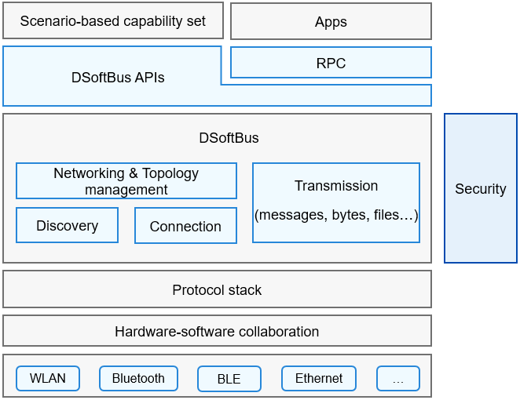

# DSoftBus

## Introduction

There are various ways of communication (such as Wi-Fi and Bluetooth) between devices. The difference in the usage of these communication methods may lead to communication issues. In addition, there are many challenges in converging and sharing communication links between devices and handling conflicts. 

DSoftBus implements unified distributed communications between near-field devices and provides APIs for device discovery, connections, networking, and data transmission, regardless of the link type. It stands out with the following capabilities:

-   Implements discovery and connections of devices in various communication modes, such as WLAN and Bluetooth.
-   Performs unified device networking and topology management, and provides device information for data transmission.
-   Sets up channels for transmitting messages, bytes, streams, and files.

You can use the APIs provided by DSoftBus to implement fast communication between devices without caring about the communication details, which accelerating deployment and running of services across platforms.

## Architecture



**Figure 1** DSoftBus architecture 

## Directory Structure

The DSoftBus directory structure is as follows:

```text
//foundation/communication/dsoftbus
├── adapter               # Adaptation code
├── components            # Dependent components
├── core                  # Core code
│   ├── adapter           # Adaptation code
│   ├── authentication    # Code for authentication
│   ├── bus_center        # Code for networking
│   ├── common            # Common code
│   ├── connection        # Code for device connections
│   ├── discovery         # Code for device discovery
│   ├── frame             # Framework code
│   └── transmission      # Code for data transmission
├── interfaces            # External APIs
├── sdk                   # SDK
│   ├── bus_center        # Networking
│   ├── discovery         # Device discovery
│   ├── frame             # Framework
│   └── transmission      # Transmission
├── tests                 # Test code
└── tools                 # Tools
```

## Constraints

-   Connections can be set up only between the devices in the same LAN or between near-field devices.
-   Before setting up a connection between two devices, you must bind devices. For details, see [Security](https://gitee.com/openharmony/docs/blob/master/en/readme/Security.md).
-   After data transmission is complete, the service needs to close the session to release resources.

## Usage

>**NOTE**
>
>The permissions ohos.permission.DISTRIBUTED_DATASYNC and ohos.permission.DISTRIBUTED_SOFTBUS_CENTER are required for remote procedure calls (RPCs) across devices.

### Device Discovery

-   **Publishing process**

1.  Call **PublishLNN()** to publish application information across a network.

    ```C
    // Callback used to return the publish result.
    typedef struct {
        /** Callback for publish result */
        void (*OnPublishResult)(int publishId, PublishResult reason);
    } IPublishCb;

    // Information to publish.
    typedef struct {
        int publishId;                 // Publish ID.
        DiscoverMode mode;             // Discovery mode.
        ExchangeMedium medium;         // Medium to use.
        ExchangeFreq freq;             // Frequency to use.
        const char *capability;        // Capability of the device to discover.
        unsigned char *capabilityData; // Custom data to publish.
        unsigned int dataLen;          // Data length.
        bool ranging;                  // Whether ranging is required.
    } PublishInfo;
    
    // Publish information.
    int32_t PublishLNN(const char *pkgName, const PublishInfo *info, const IPublishCb *cb);
    ```

2.  Call **StopPublishLNN** to stop publishing information when it is not required.

    ```C
    // Stop publishing a service.
    int32_t StopPublishLNN(const char *pkgName, int32_t publishId);
    ```


-   **Discovery process**

1. Call **RefreshLNN()** to discover devices with the specified capability.

   ```C
   // Callbacks for device discovery.
   typedef struct {
       /** Callback to be invoked when a device is found. */
       void (*OnDeviceFound)(const DeviceInfo *device);
       /** Callback for a subscription result. */
       void (*OnDiscoverResult)(int32_t refreshId, RefreshResult reason);
   } IRefreshCallback;
   
   // Start device discovery.
   int32_t RefreshLNN(const char *pkgName, const SubscribeInfo *info, const IRefreshCallback *cb);
   ```

   DSoftBus notifies the service of the device information via a callback once a device is found.

3.  Call **StopRefreshLNN()** to stop device discovery.

    ```C
    // Stop the discovery.
    int32_t StopRefreshLNN(const char *pkgName, int32_t refreshId);
    ```

### Networking

1.  Initiate a request for connection with the target device address and a callback used to return the connection result.

    ```C
    // Address of the target device to connect to.
    typedef struct {
        ConnectionAddrType type;
        union {
            struct BrAddr {
                char brMac[BT_MAC_LEN];
            } br;
            struct BleAddr {
                char bleMac[BT_MAC_LEN];
                uint8_t udidHash[UDID_HASH_LEN];
            } ble;
            struct IpAddr {
                char ip[IP_STR_MAX_LEN];
                uint16_t port; 
            } ip;
        } info;
        char peerUid[MAX_ACCOUNT_HASH_LEN];
    } ConnectionAddr;
    
    // Address type.
    typedef enum {
        CONNECTION_ADDR_WLAN = 0,
        CONNECTION_ADDR_BR,
        CONNECTION_ADDR_BLE,
        CONNECTION_ADDR_ETH,
        CONNECTION_ADDR_MAX
    } ConnectionAddrType;
    
    // Callback used to return the connection result.
    typedef void (*OnJoinLNNResult)(ConnectionAddr *addr, const char *networkId, int32_t retCode);
    
    // Initiate a connection request.
    int32_t JoinLNN(const char *pkgName, ConnectionAddr *target, OnJoinLNNResult cb);
    ```

2. Wait for the connection result. 

   If **JoinLNN()** returns success, DSoftBus accepts the connection request and notifies the service of the connection result through the callback. The **addr** parameter in the callback matches the **target** parameter in **JoinLNN()**. If **retCode** in the callback is **0**, the connection is successful. In this case, the value of **networkId** is valid and will be used in the data transmission and disconnection APIs. If the value of **retCode** is not **0**, the connection fails, and the value of **networkId** is invalid.

3. Transmit data using the related APIs.

4. Initiate a disconnection request with the **networkId** and a callback for returing the result.

   ```C
   // Callback used to return the disconnection result.
   typedef void (*OnLeaveLNNResult)(const char *networkId, int32_t retCode);
   
   // Initiate a disconnection request.
   int32_t LeaveLNN(const char *pkgName, const char *networkId, OnLeaveLNNResult cb);
   ```

5. Wait until the disconnection is complete. 

   The **networkId** parameter in **OnLeaveLNNResult()** matches **networkId** in **LeaveLNN()**. If **retCode** in the callback is **0**, the disconnection is successful; otherwise, the disconnection fails. If the disconnection is successful, **networkId** becomes invalid and can no longer be used.

6. Register and unregister callbacks for device state changes.

   ```C
   // Device state events.
   #define EVENT_NODE_STATE_ONLINE 0x1
   #define EVENT_NODE_STATE_OFFLINE 0x02
   #define EVENT_NODE_STATE_INFO_CHANGED 0x04
   #define EVENT_NODE_STATUS_CHANGED 0x08
   #define EVENT_NODE_STATE_MASK 0xF
   
   // Device information.
   typedef struct {
       char networkId[NETWORK_ID_BUF_LEN];
       char deviceName[DEVICE_NAME_BUF_LEN];
       uint16_t deviceTypeId;
   } NodeBasicInfo;
   
   // Device state event callbacks.
   typedef struct {
       uint32_t events; // Networking event mask.
       void (*onNodeOnline)(NodeBasicInfo *info);   // Called when the device gets online.
       void (*onNodeOffline)(NodeBasicInfo *info);  // Called when the device gets offline.
       void (*onNodeBasicInfoChanged)(NodeBasicInfoType type, NodeBasicInfo *info); // Called when the device information changes.
       void (*onNodeStatusChanged)(NodeStatusType type, NodeStatus *status); // Called when the device running status changes.
   } INodeStateCb;
   
   // Register a callback for device state events.
   int32_t RegNodeDeviceStateCb(const char *pkgName, INodeStateCb *callback);
   
   // Unregister a callback for device state events.
   int32_t UnregNodeDeviceStateCb(INodeStateCb *callback);
   ```

### Transmission

1.  Create a **Socket** instance.

    ```C
    typedef struct {
        char *name;                 // Local socket name.
        char *peerName;             // Peer socket name.
        char *peerNetworkId;        // Peer network ID.
        char *pkgName;              // Bundle name of the caller.
        TransDataType dataType;     // Type of the data to be transmitted.
    } SocketInfo;
    
    // Create sockets.
    int32_t Socket(SocketInfo info);
    ```

2.  Start listening for the socket on the server, and bind the socket on the client.

    ```C
    // Socket callbacks.
    typedef struct {
        void (*OnBind)(int32_t socket, PeerSocketInfo info);
        void (*OnShutdown)(int32_t socket, ShutdownReason reason);
        void (*OnBytes)(int32_t socket, const void *data, uint32_t dataLen);
        void (*OnMessage)(int32_t socket, const void *data, uint32_t dataLen);
        void (*OnStream)(int32_t socket, const StreamData *data, const StreamData *ext, const StreamFrameInfo *param);
        void (*OnFile)(int32_t socket, FileEvent *event);
        void (*OnQos)(int32_t socket, QoSEvent eventId, const QosTV *qos, uint32_t qosCount);
        void (*OnError)(int32_t socket, int32_t errCode);
        void (*OnBytesSent)(int32_t socket, uint32_t dataSeq, int32_t errCode);
    } ISocketListener;

    typedef enum {
        QOS_TYPE_MIN_BW,            // Minimum bandwidth.
        QOS_TYPE_MAX_WAIT_TIMEOUT,  // Bind timeout.
        QOS_TYPE_MIN_LATENCY,       // Minimum connection latency.
        QOS_TYPE_RTT_LEVEL,         // Round-trip time (RTT) level.
        QOS_TYPE_MAX_BUFFER,        // Maximum buffer (reserved).
        QOS_TYPE_FIRST_PACKAGE,     // Size of the first packet (reserved).
        QOS_TYPE_MAX_IDLE_TIMEOUT,  // Maximum idle time.
        QOS_TYPE_TRANS_RELIABILITY, // Transmission reliability (reserved).
        QOS_TYPE_BUTT,
    } QosType;

    typedef struct {
        QosType qos;
        int32_t value;
    } QosTV;

    // Start listening for the socket on the server.
    int32_t Listen(int32_t socket, const QosTV qos[], uint32_t qosCount, const ISocketListener *listener);

    // Bind the socket on the client.
    int32_t Bind(int32_t socket, const QosTV qos[], uint32_t qosCount, const ISocketListener *listener);
    ```

4. Send data to the peer device through the socket.

    ```C
    // Send bytes.
    int32_t SendBytes(int32_t socket, const void *data, uint32_t len);
    // Async Send bytes. dataSeq Indicates the unique seq number of the packet to be send. which cannot be zero.
    int32_t SendBytesAsync(int32_t socket, uint32_t dataSeq, const void *data, uint32_t len);    
    // Send messages.
    int32_t SendMessage(int32_t socket, const void *data, uint32_t len);
    // Send a stream.
    int32_t SendStream(int32_t socket, const StreamData *data, const StreamData *ext, const StreamFrameInfo *param);
    // Send a file.
    int32_t SendFile(int32_t socket, const char *sFileList[], const char *dFileList[], uint32_t fileCnt);
    ```

4. Shut down a socket.

    ```C
    // Shut down a socket.
    void Shutdown(int32_t socket);
    ```

### Device Management


-   Select Wi-Fi keepalive mode.

Call **ShiftLNNGear** on the DSoftBus client to invoke the server **ShiftLNNGear** through an IPC interface. The policy management module adjusts the **keepalive** property of the TCP persistent connection based on the specified policy.

```C
typedef struct {
    ModeCycle cycle;             // Keepalive probe interval.
    ModeDuration duration;       // Heartbeat mode duration.
    bool wakeupFlag;             // Whether the heartbeat signal wakes up the peer device.
    ModeAction action;           // Action to be taken during the keepalive process.
} GearMode;

typedef enum {
    HIGH_FREQ_CYCLE = 30,         // Heartbeat interval 30s.
    MID_FREQ_CYCLE = 60,          // Heartbeat interval 60s.
    LOW_FREQ_CYCLE = 5 * 60,      // Heartbeat interval 5 minutes.
    DEFAULT_FREQ_CYCLE = 10 * 60, // Heartbeat interval 10 minutes.
} ModeCycle;

// Adjust the keepalive parameters of a TCP persistent connection based on the specified gear mode.
int32_t ShiftLNNGear(const char *pkgName, const char *callerId, const char *targetNetworkId, const GearMode *mode);
```

The TCP keepalive duration varies, depending on **ModeCycle**.  

```C
HIGH_FREQ_CYCLE = 30, // The TCP keepalive duration is within 40s.
MID_FREQ_CYCLE = 60, // The TCP keepalive duration is within 70s.
LOW_FREQ_CYCLE = 5 x 60, // The TCP keepalive duration is within 315s.
DEFAULT_FREQ_CYCLE = 10 x 60, // The TCP keepalive duration is within 615s.
```

## Repositories Involved

[DSoftBus](https://gitee.com/openharmony/docs/blob/master/en/readme/dsoftbus.md)

**communication_dsoftbus**

[communication_bluetooth](https://gitee.com/openharmony/communication_bluetooth)

[communication_ipc](https://gitee.com/openharmony/communication_ipc)

[communication_wifi](https://gitee.com/openharmony/communication_wifi)
